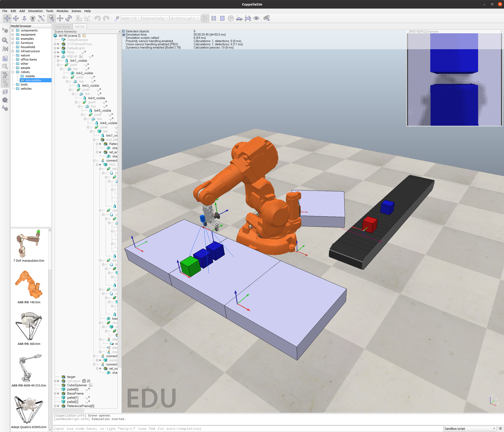

# README

**pyARTE** is a Python toolbox focussed on robotic manipulators.

The library uses Coppelia Sim as the main way to produce a representation of the robots and methods.

The main features of **pyARTE** are:

* Simulate some industrials robot within the Coppelia Sim environment.
* Path planning and obstacle avoidance.
* Practical exercises are provided.

Created by [Arturo Gil](http://arvc.umh.es/personal/arturo/index.php?lang=en&vista=normal&dest=inicio&idp=arturo&type=per&ficha=on): arturo.gil@umh.es. [Miguel Hernández University, Spain.](http://www.umh.es)

pyARTE is distributed under LGPL license.




# INSTALL

## DOWNLOAD THE CODE
Clone this repository:

```
>> git clone https://github.com/4rtur1t0/pyARTE.git
```

Download and extract CoppeliaSim on your PC. Download Coppelia from https://www.coppeliarobotics.com/downloads.

Next, clone the coppelia_API:
```
>> git clone https://github.com/4rtur1t0/coppelia_API.git
```
Please, note that the Coppelia API is part of the distribution of Coppelia and has been included in a different 
repository for installation purposes. If using Windows or Mac, you should look for your corresponding system library interface.


## INSTALL SYSTEM PACKAGES
Install python virtualenv
```
>> sudo  apt-get install virtualenv
```

Install python3-tk
```
>> sudo  apt-get install python3-tk
```

## CREATE A VIRTUAL ENVIRONMENT
We will be creating a virtualn environment at your user's home/Applications directory: 
```
>> cd
>> mkdir Applications
>> cd Applications
>> virtualenv venv
```

Next, install some needed python packages. We only require matplotlib, numpy and pynput:
```
>> cd /home/user/Applications/venv/bin
>> ./pip install numpy matplotlib pynput
```

## CONFIGURE YOUR IDE

Open the project in Pycharm (or any other python editor). Use the option ''add root content'' in 
File-Settings-Project Structure-- Add Content Root. Under the root content (the files that will be included in the python
execution), you should include:
- Add the directory coppelia_API.
- Add pyARTE itself.


## INSTALL COPPELIA SIM
Edu 

## TEST
Open Coppelia Sim
Open the ur5_conveyor_belt.ttt scene
Open the pyARTE/practicals/ur5_move_robot.py

Execute ur5_move_robot.py. Use 1, 2, 3, 4, 5, 6 and the keys below to increment/decrement any joint qi. Use o or c to 
open/close the gripper.


##SCENES
The directory pyARTE/scenes includes a set of scenes that should be opened in Coppelia Sim in order to execute the demos or tutorials in this library.


